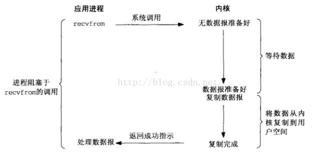
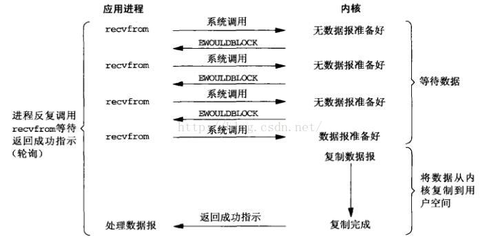

* [一、I/O 模型](#一、I/O-模型)
    * [阻塞式 I/O](#阻塞式-I/O)
    * [非阻塞式 I/O](#非阻塞式-I/O)
    * [I/O 复用](#I/O-复用)
    * [信号驱动式 I/O](#信号驱动式-I/O)
    * [异步 I/O](#异步-I/O)
* [二、I/O复用](#二、I/O复用)

# 一、I/O 模型
一个输入操作通常包括两个不同的阶段：  
- 等待数据准备好
- 从内核向进程复制数据

对于一个套接字上的输入操作，分为以下两个步骤：  
- 等待数据从网络中到达。当所等待分组到达时，它被复制到内核中的某个缓冲区
- 把数据从内核缓冲区复制到应用进程缓冲区

Unix 有下面5种 I/O 模型：
- 阻塞式 I/O
- 非阻塞式 I/O
- I/O 复用
- 信号驱动式 I/O
- 异步 I/O
## 阻塞式 I/O
应用进程被阻塞，直到数据报到达且被复制到应用进程的缓存区中或者发送错误才返回。

应该注意到，在阻塞的过程中，其他应用进程还可以执行，因此阻塞并不意味着整个操作系统被阻塞。因为其他应用进程还可以执行，所以不消耗 CPU 时间，所以这种模型的CPU 利用率会比较高。

下图中，recvfrom 用于接收 Socket 传来的数据，并复制到应用进程的缓冲区 buf 中。这里把 recvfrom() 当成系统调用。
```c
ssize_t recvfrom(int sockfd, void *buf, size_t len, int flags, struct sockaddr *src_addr, socklen_t *addrlen);
```
参数说明：
- sockfd: 描述符
- buf: 指定写入缓冲区的指针 
- len: 写字节数
- flags: 
- src_addr:
- addrlen: 
<div align="center">  </div><br>

## 非阻塞式 I/O
应用进程执行系统调用后，内核返回一个错误码。应用进程可以继续执行，但是需要不断地执行系统调用来获知 I/O 是否完成，这种方式称为轮询。

由于 CPU 要处理更多的系统调用，因此这种模型的 CPU 利用率是比较低的。
<div align="center">  </div><br>

## I/O 复用

## 信号驱动式 I/O

## 异步 I/O